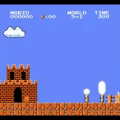

# Machine play Mario with Reinforcement-Learning and Semantic Segmentation

[](https://shields.io/)
[](https://shields.io/)
[](https://pypi.python.org/pypi/ansicolortags/)

<p align="center">
  
  
</p>
<p align="center">
    <em>Mario after training.</em>
</p>

## **About project**
Our project focused on how to train a RL agent using SS output as input for RL, so we do not cover training the SS model in this project. 

You can see our full project and experiments on Kaggle:  
[Mario Project on Kaggle](https://www.kaggle.com/code/kamuisi/mario-project)

Our work is based on the original project from [Semantic-Segmentation-Boost-Reinforcement-Learning](https://github.com/vpulab/Semantic-Segmentation-Boost-Reinforcement-Learning/tree/69eace77a3437f98b1b437074adee5a578803581/RL)

---

## **Research Approach**

In this project, we systematically explored and improved deep reinforcement learning algorithms for the Super Mario Bros environment. Our research began with the implementation of the Deep Q-Network (DQN) algorithm as a baseline. We then enhanced the agent's performance and stability by adopting the Double DQN (DDQN) approach, which addresses the overestimation bias of Q-values present in standard DQN. Finally, we further advanced our model by applying the Dueling DDQN architecture, which separates the estimation of state value and advantage, leading to more robust learning and improved results.

This step-by-step progression allowed us to analyze the strengths and weaknesses of each algorithm and demonstrate the benefits of each improvement in the context of training an agent to play Mario.

---

## **Key Algorithms and Their Equations**

### 1. Deep Q-Network (DQN)

The DQN algorithm updates the Q-value using the Bellman equation:
```python
Q[s_t, a_t] = Q[s_t, a_t] + alpha * (r_t + gamma * np.max(Q[s_t1, :]) - Q[s_t, a_t])
```
In practice, the loss function minimized is:
```python
loss = (r + gamma * target_net(next_state).max(1)[0] - policy_net(state).gather(1, action)).pow(2).mean()
```
---

### 2. Double DQN (DDQN)

Double DQN reduces overestimation by decoupling action selection and evaluation:
```python
next_actions = policy_net(next_state).max(1)[1].unsqueeze(1)
target_q = target_net(next_state).gather(1, next_actions)
y_ddqn = reward + gamma * target_q * (1 - done)
```
The loss function is:
```python
loss = (y_ddqn - policy_net(state).gather(1, action)).pow(2).mean()
```
---

### 3. Dueling DDQN

```python
# Dueling DQN Q-value calculation
# V: value stream, A: advantage stream, a: action, s: state
Q = V(s) + (A(s, a) - A(s, : ).mean(dim=1, keepdim=True))
```
---
These mathematical formulations are the foundation for the improvements we implemented and tested in our Mario RL